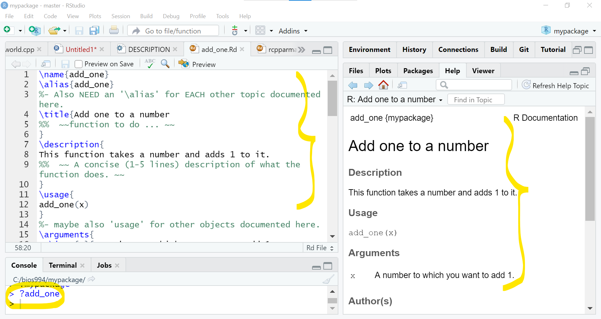
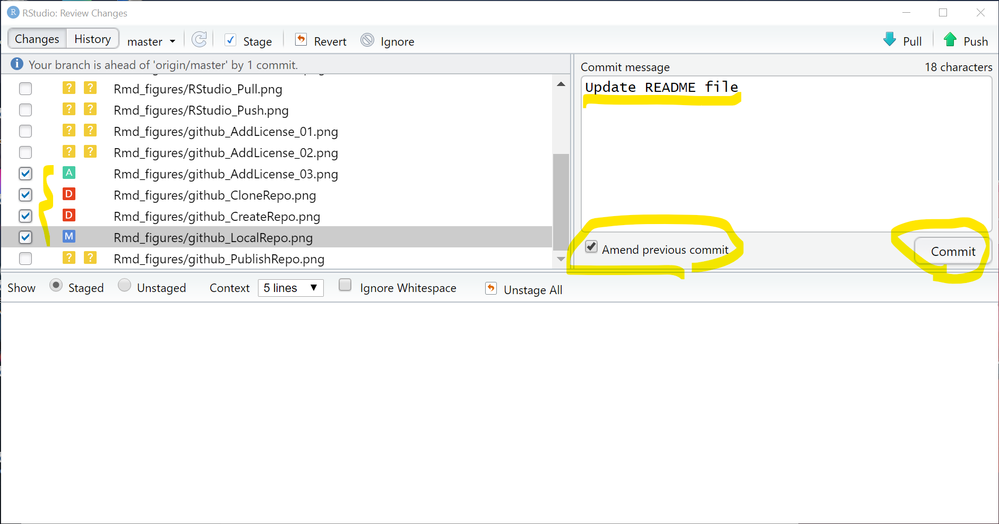

A tutorial for creating a R package and publish to GitHub
================

## 1 Requirements

To reconstruct this tutorial, download and install the latest version of
R(4.0.3), RStudio(1.4.1103), GitHub Desktop(2.6.2), `devtools`(2.3.2),
`Rcpp`(1.0.6), `RcppArmadillo`(0.10.1.2.2 ), `microbenchmark`(1.4-7),
`rmarkdown`(2.6).

## 2 Instructions of creating a R package using RStudio

#### 2.1 Create a new project in RStudio

In the **File** menu, click on **New Project**. Then select **New
Directory** and **R Package using RcppArmadillo** to create a new R
package with built-in examples for C++ scripts incorporating Armadillo
library. Type the name of your package and choose the directory of this
project on your device. Click **Create project**.
<!-- --><!-- --><!-- -->

#### 2.2 Essential files/folders for a R package

On the lower right hand side of your screen, you should see the
directory, under the **Files** tab, of the project that you just
created.</br> The **R** folder contains the R scripts for your
package.</br> The **src** folder contains the C++ scripts to be compiled
for your package.</br> The **man** folder saves the help/manual files
for each function in your package, and you can edit them after you
compile the package for the first time.</br> The **DESCRIPTION** file
contains basic description of your package.</br>
<!-- -->

#### 2.3 Compile your package

For illustrative purpose, you can write a simple R function such as

``` r
add_one <- function(x){x+1}
```

and save the R script file `myfunc.R` to **R** folder.
<!-- --> To create a C++ script file,
under the **File** menu, click **New File** then **C++ File**. Delete or
comment the R code block at the end of the template. Change the first
two lines to
`{c++ RcppFunc header, eval=FALSE} #include <RcppArmadillo.h> // [[Rcpp::depends(RcppArmadillo)]] using namespace Rcpp;`
and write a simple function like
`{c++ RcppFunc, eval=FALSE} // [[Rcpp::export]] double add_one_cpp(const double& x) {   return x+1.0; }`
and save the C++ script file `myfunc_cpp.cpp` to **src** folder.
<!-- --> If you want to test the
C++ function before compiling the package, in R console, run

``` r
library(Rcpp)
sourceCpp("src/myfunc_cpp.cpp")
add_one_cpp(3) # should return 4 in this example
```

More examples of Armadillo, Rcpp, and RcppArmadillo can be found at
[Armadillo library](http://arma.sourceforge.net/docs.html#syntax),
[Writing R code in C++](https://adv-r.hadley.nz/rcpp.html),
[RcppArmadillo
package](https://cran.r-project.org/web/packages/RcppArmadillo/index.html).</br>
Open the **DESCRIPTION** file, modify/add Title, Version, Date, Author,
Maintainer, Description, License, URL, BugReports, and other useful
information. All the information can be viewed by running
`?yourpackagename` in R console.
<!-- --> Finally, you can
compile the package by, in the **Build** menu, clicking **Install and
Restart**, and you need to always use this option when you want
re-compile the package. <!-- -->

#### 2.4 Modify help files/user manuals

Once you compile the package, you will find help files/user
manuals(**.Rd** files) for each function and the package under **man**
folder. You need to modify them before publishing the package.</br>
First of all, open **yourpackagename-package.Rd**, delete or comment all
the texts surrounded by `~~`. Otherwise, they will cause errors when
other users install your package from GitHub. Other fields in this file
are mainly inherited from the **DESCRIPTION** file, so you can keep them
unchanged. <!-- --> Next, open
**.Rd** files for each function, delete or comment texts surrounded by
`~~`, provide title, description, item, examples, and other useful
information. The information in these files can be viewed by running
`?functionname` in R console.
<!-- -->

#### 2.5 Write a README file

A README file is highly commended to help other users understand your
package. However, using the basic **Markdown** syntax to write such file
is painful since the difficulties in inserting math symbols and
controlling for layouts. Fortunately, RStudio provides a R Markdown
template for GitHub documents. In addition, after you knit the R
Markdown file, a GitHub Markdown file will be automatically generated
and it can be used on GitHub without any change.</br> To create a R
Markdown file, in the **File** menu, click **New File** then **R
Markdown**. In the new window, choose **From Template** and **GitHub
Document (Markdown)**. <!-- -->
Once you finish editing the R Markdown file, save it as **README.Rmd**
under the main directory and knit the file. Then you will see the
**README.md** file in the main directory.</br> Some examples of R
Markdown and Markdown syntax can be found on [R Markdown cheat
sheet](https://raw.githubusercontent.com/rstudio/cheatsheets/master/rmarkdown-2.0.pdf)
and [Markdown demo](markdown-it.github.io).

#### 2.6 Connect to GitHub: commit, push, pull

Now, you can set up a git repository and add it to the project. In the
**Tools** menu, click on **Project Options**. Then select **Git/SVN**
and change the **version control system** from (None) to Git. Click
**OK** to initialize a new Git repository.
<!-- --> Open GitHub Desktop, in the
**File** menu, click **Add local repository**. Type the repository name
on GitHub, select the visibility of repository, and publish the
repository. <!-- -->

Next step is to commit your changes. To do so, click **Git** tab in top
right panel, and then click the **commit** option. </br> Then select the
changes you want to commit. ‘A’ in a green box means a new file, which
was not in the last commit. ‘D’ in a red box means a file that has been
deleted from the last commit. ‘M’ in a blue box means a file from the
last commit, but its content has been modified. Using ‘Ctrl+A’ could
select all the changes.</br> Once you have selected the changes, write
some descriptions to the **Commit message** window and then click
**Commit**. If you want to keep your commit history be concise, you can
check the **Amend previous commit** option to combine multiple commits
that have not been pushed to GitHub.
<!-- --><!-- -->

Push your commits to GitHub and pull the latest commits from GitHub can
be easily done by clicking the **Push** button and **Pull** button in
the **Review Changes** window.
<!-- -->

Sometime you do not find mistakes immediately, and you need to look
backwards in history and find out where they occurred. You can use the
**Review Changes** window again to access the history of commits. If you
click one previous commit, the changes, with file names, made by this
commit will de displayed at the bottom of the window. Then you can click
**Vile file @ SHA** to view the original files and find them back.
<!-- --><!-- -->

More details and operations of publishing a R package to GitHub can be
found in book [R Packages](https://r-pkgs.org/git.html#git-ignore)

#### 2.7 Add a license

If you worry about the intellectual property of the package, you can add
a license to your repository on GitHub.</br> Firstly, go to your GitHub
repository. In the **Add file** menu, click **Create new file**. Type
‘LiCENSE’ in the blank, and then the **Choose a license template**
button will pop out. Click this button, select a type of license that
meets your requirements, make sure the full name is correct, and submit.
Lastly, you need to make a commit for this file.</br>
<!-- --><!-- --><!-- -->
In most cases, **Apache**, **GNU**, or **MIT** license are good choices.
If you need more information to select the license, you can refer to
[GitHub
Docs](https://docs.github.com/en/github/creating-cloning-and-archiving-repositories/licensing-a-repository)
and [choosealicense.com](https://choosealicense.com/).

## 3 Install and load the ‘mypackage’ package

Install the development version using `devtools` package:

``` r
devtools::install_github("jitonglou/mypackage")
```

Load the package:

``` r
library(mypackage)
```

#### 3.1 Call functions in the package

``` r
add_one(1.5)
```

    ## [1] 2.5

``` r
add_one_cpp(1.5)
```

    ## [1] 2.5

#### 3.2 Benchmark functions

There are at least five functions/packages for measuring the running
time of R code (`Sys.time` and `system.time`) or benchmarking R code
(`rbenchmark`, `microbenchmark`, and `tictoc`). In this document, I take
`microbenchmark` as an example, and additional examples can be found in
[this blog](https://www.alexejgossmann.com/benchmarking_r/)

``` r
library(microbenchmark)

check_for_equal_results <- function(values) {
  tol <- 1e-8
  max_error <- abs(values[[1]]-values[[2]])
  max_error < tol
}

mbm <- microbenchmark(
  "r" = {y = add_one(1)},
  "cpp" = {y = add_one_cpp(1)},
   check = check_for_equal_results
)

mbm
```

    ## Unit: nanoseconds
    ##  expr  min   lq mean median   uq   max neval cld
    ##     r  400  400  570    400  500 12200   100  a 
    ##   cpp 1200 1400 1732   1500 1800 11400   100   b

I used the function argument `check` to check for equality (up to a
maximal error of `1e-8`) of the results returned by the two functions.
If the results weren’t equal, `microbenchmark` would return an error
message.</br> A great feature of `microbenchmark` is the integration
with `ggplot2` for plotting benchmark results.

``` r
library(ggplot2)
autoplot(mbm)
```

<!-- -->

In this case, the function coded in C++ is slower than the default
addition operation in R.

## Reference

1.  Kim IS, Martin P, McMurry N, and Halterman A. [*Instructions for
    Creating Your Own R
    Package*.](http://web.mit.edu/insong/www/pdf/rpackage_instructions.pdf) 2018.
    </br>
2.  Wickham H and Bryan J. [*R
    Packages*.](https://r-pkgs.org/index.html) 2019.
